# GitHub e README.md

> IMPORTANTE: Antes de iniciar qualquer projeto devemos ter uma conta no [**GITHUB**](https://github.com/), depois de ter um cadastro no github podemos seguir os passo a frente

## O Passo a Passo da Criação e Envio

Para iniciar um projeto no Github, faça login na sua conta e siga os passos abaixo

### Criando Repositório no Github

| 1. Va em **New** para criar um novo repositório.      | 2. Escolher nome do projeto/repositório                         |
| ----------------------------------------------------- | --------------------------------------------------------------- |
| 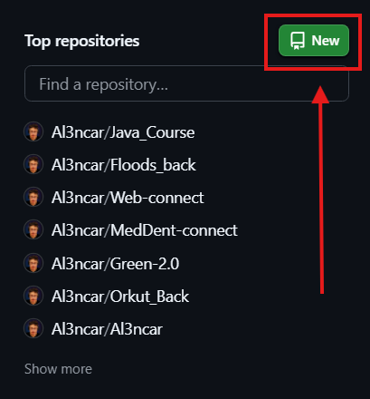 | 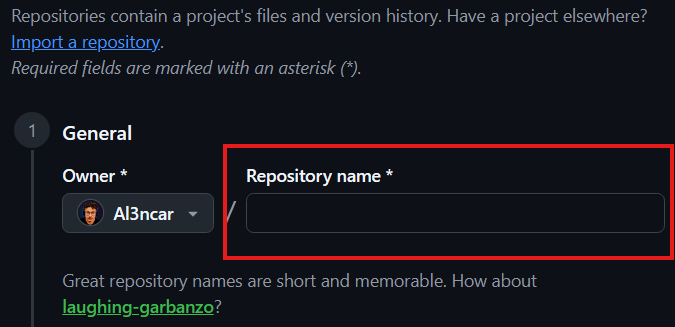 |

| 3. Adicionar descrição ao projeto **(OPCIONAL)**                    | 4. Define se vai ser um repositório **público ou privado**                      |
| ------------------------------------------------------------------- | ------------------------------------------------------------------------------- |
| 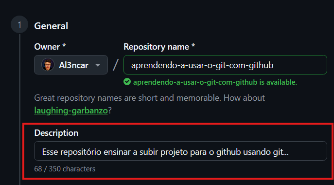 | 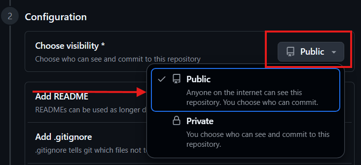 |

| 5. Colocar o README para "ON" (ligado), ou seja, quando o repositório for criado ele ja vai criar o README.md | 6. Agora vamos em **Create repository** para criar de fato o repositório |
| ------------------------------------------------------------------------------------------------------------- | ------------------------------------------------------------------------ |
| 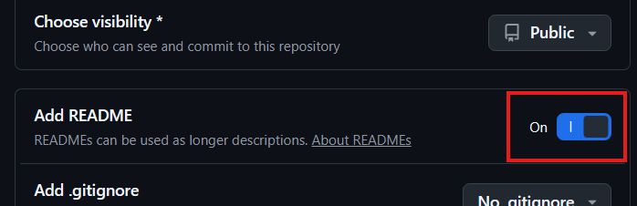                                              | 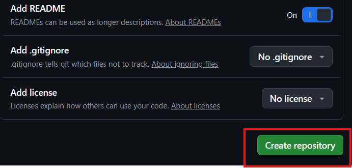        |

### Subindo arquivos no Github

Existe muitas formas de subir seu projeto no Github. Você pode mandar os arquivos na mão direto pelo navegador (Upload), rodar os comandos do Git no terminal (Exemplo que será mostrado a seguir), resolver tudo nas extensões do próprio [VSCode](https://code.visualstudio.com/) ou usar o [GitHub Desktop](https://desktop.github.com/download/) para deixar o processo mais simples.

Depois disso, crio a pasta do projeto no meu computador e abro no VS Code.

```java

import java.util.Scanner;

public class Main {
    public static double media(double x, double y) { return (x + y) / 2; }

    public static void main(String[] args) {
        Scanner sc = new Scanner(System.in);

        double x, y;

        System.out.print("Digite a 1° nota");
        x = sc.nextDouble();
        sc.nextLine();

        System.out.print("Digite a 2° nota");
        y = sc.nextDouble();
        sc.nextLine();

        System.out.print("Resultado: " + media(x, y));
        sc.close();
    }
}

```

Nesse exemplo, estamos criando um arquivo de codigo simples em Java, Esse código calcúla a média do(a) aluno(a). Depois de criar o arquivo em java, devemos usar os comandos git para subir nosso projeto no **Terminal Powershell**, **CMD** ou **Git Bash**. Os comandos seram igual independente do local de versionamento.

No terminal, vamos adicionar os comandos:

Inicializar o **.git** na pasta do projeto:

```bash
git init
```

Em seguida, conecto a pasta ao repositório que criei no GitHub:

```bash
git remote add origin URL_DO_REPOSITORIO
```

Depois posso enviar os arquivos seguindo o fluxo:

```bash
git add .
git commit -m "Primeiro commit"
git push -u origin main
```

O `git add` **prepara os arquivos**, o `commit` **registra as alterações** e o `push` **envia tudo para o GitHub**. A partir daí, os arquivos já ficam disponíveis no meu repositório `aprendendo-a-usar-o-git-com-github`

## A Anatomia do README Perfeito

O **README.md** é basicamente a apresentação do projeto. Ele ajuda outras pessoas a entenderem rapidamente o que foi desenvolvido e como utilizar o projeto. Pode ser útil para outros estudantes, desenvolvedores, professores e até recrutadores

Algumas informações importantes para colocar em um README são:

- **Título:** nome do projeto.
- **Descrição:** explica de forma rápida qual é o objetivo.
- **Tecnologias:** mostra as linguagens, frameworks e ferramentas utilizadas.
- **Como executar:** explica como instalar e rodar o projeto.
- **Exemplo ou demonstração:** pode ter imagens, prints ou exemplos.
- **Autor:** informações sobre quem desenvolveu.
- **Status:** mostra se o projeto está em desenvolvimento ou concluído.

O Markdown é utilizado porque é uma forma simples de formatar textos. Com ele consigo criar títulos, listas, links, códigos e destaques sem precisar escrever HTML, deixando o README mais organizado e fácil de ler.

## O Mapa das Atualizações

Existem algumas formas diferentes de atualizar um projeto no GitHub.

### GitHub pelo navegador

Posso editar e subir um arquivo diretamente pelo GitHub, para alterar devemos ir no clicando no ícone de **lápis** e depois fazendo o commit. Para subir podemos clicar em '**Add file**' ou '**+**' e depois ir em **Upload files**.

#### Exemplo de upload:

| 1. Vá até o repositório, clique em "Add file" e depois em "Upload files" | 2. Devemos arrastar o arquivo, preencher os campos e finalizar         |
| ------------------------------------------------------------------------ | ---------------------------------------------------------------------- |
| 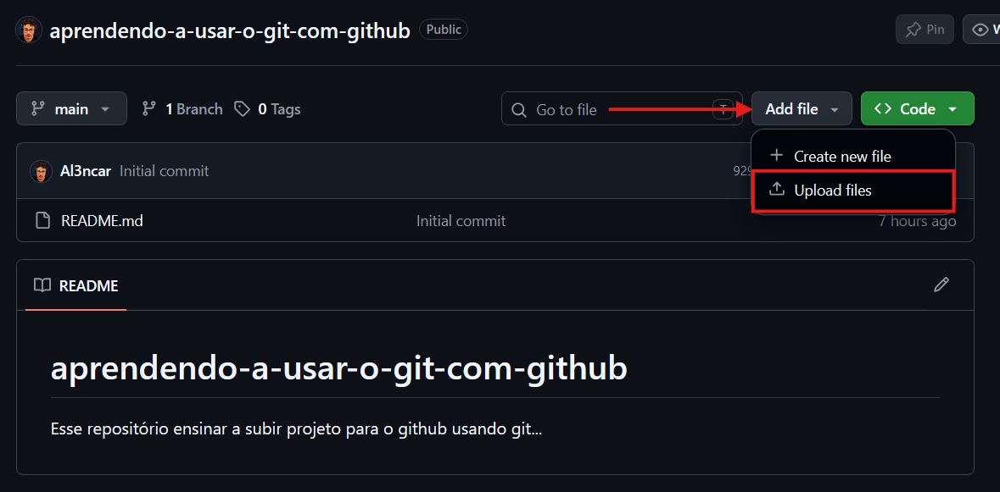        | 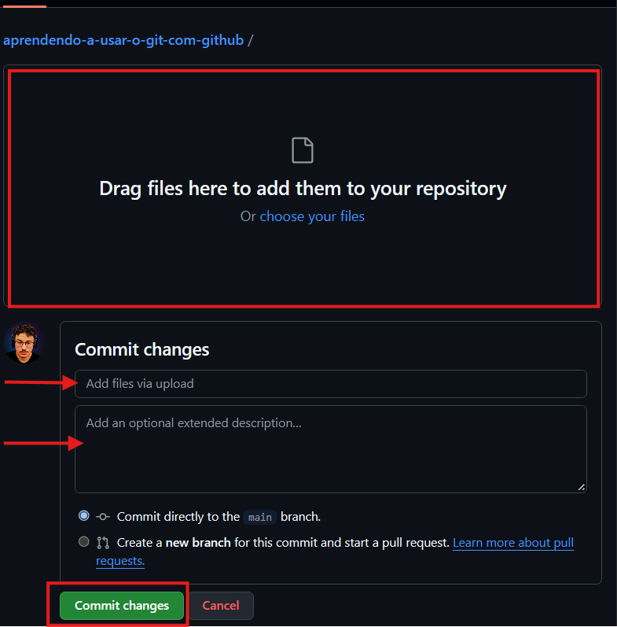 |

#### Exemplo de Alteração:

É uma opção boa para alterações pequenas e rápidas, mas não é tão prática para desenvolver projetos maiores.

| 1. Clique no _Lapis_                                                       | 2. Faça a alteração                                                          |
| -------------------------------------------------------------------------- | ---------------------------------------------------------------------------- |
| 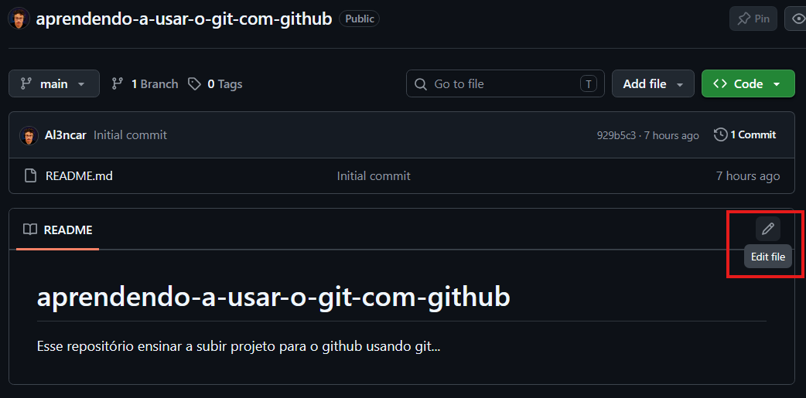 | 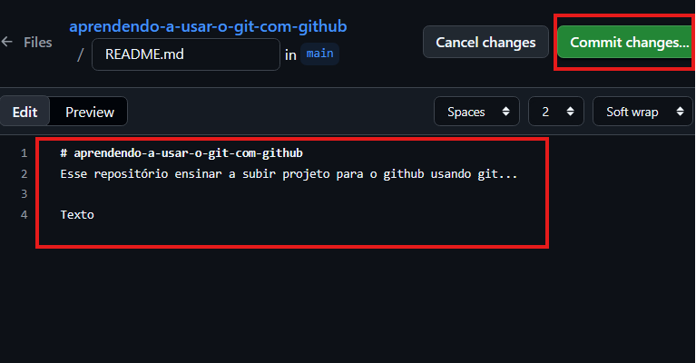 |

| 3. Adicione as informações                                                    | 4. Suba as alterações                                                          |
| ----------------------------------------------------------------------------- | ------------------------------------------------------------------------------ |
| 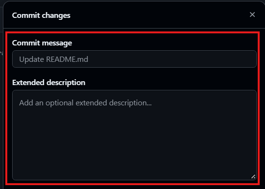 | 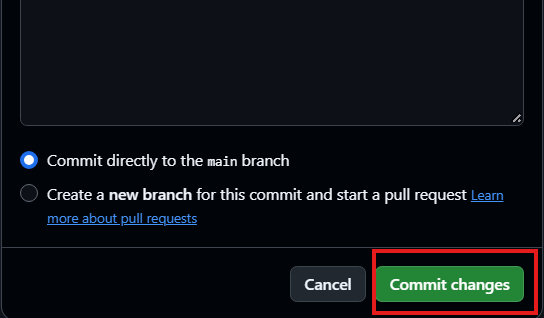 |

### Git pelo Terminal

É a forma que mais vejo sendo utilizada no desenvolvimento. Depois de alterar os arquivos, posso fazer:

```bash
git add .
git commit -m "Atualiza projeto"
git push
```

Assim consigo controlar o histórico das alterações e enviar tudo para o repositório.

### VS Code

O **VS Code** possui integração com Git. Pela aba **Source Control**, consigo visualizar os arquivos alterados, fazer o _stage_, criar o commit e sincronizar as alterações com o GitHub sem precisar sair do editor.

Na minha ultima experiencia profissional usavamos bastante esse modelo de subir as informações, junto com o Github Desktop.

Exemplo rapido de envio:

| 1. Deve clicar nesse icone, onde tem o numero "1".          | 2. devemos adicionar o arquivos em alterações que iram subir, fazer o comentario e subir                                                   |
| ----------------------------------------------------------- | ------------------------------------------------------------------------------------------------------------------------------------------ |
| 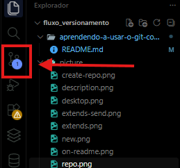 | 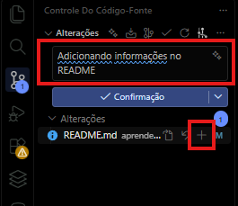 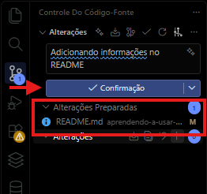 |

### GitHub Desktop

O GitHub Desktop é uma opção mais visual. Consigo ver as alterações, conferir os _diffs_, criar commits e publicar o projeto sem precisar utilizar o terminal. É atualmente uma das ferramentas mais utilizadas, principalmente quando a muitos projetos e muitos commits envolvidos.Ele é bem semelhante com as informações que tem no **Source Control**.

Demonstração Visual do Github desktop e suas alterações:

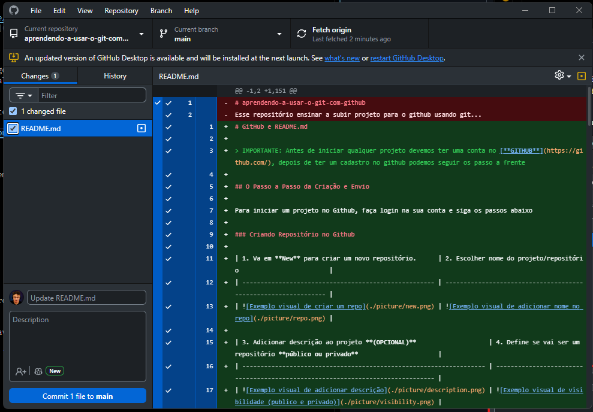

### Rotina de versionamento

Acho importante fazer commits frequentemente e em pequenas partes. Em vez de deixar várias alterações acumuladas e enviar tudo de uma vez, é melhor registrar cada etapa.

Por exemplo:

```text
"Cria estrutura inicial"
"Adiciona tela de login"
"Corrige validação"
"Atualiza README"
```

Assim fica mais fácil entender o histórico do projeto, encontrar problemas e até voltar para uma versão anterior se for necessário.

O fluxo que mais vou utilizar no dia a dia provavelmente será:

    Alterar código → `git add` → `git commit` → `git push` → GitHub.**
